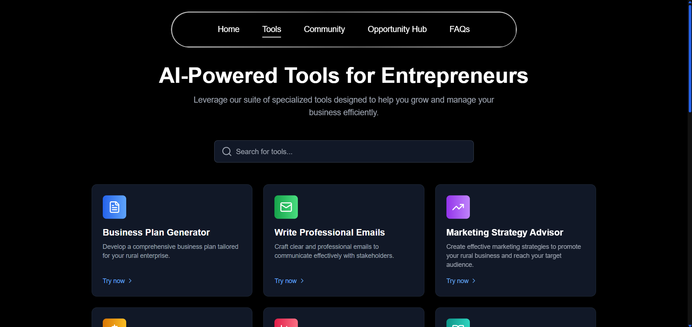

# AIEnterpreNova



## About
AIEnterpreNova is a comprehensive platform designed to help rural entrepreneurs succeed in their ventures. The platform provides resources, tools, and guidance for starting, growing, and managing businesses in rural areas.

## Mission
Our mission is to empower rural entrepreneurs by providing them with access to high-quality resources, AI-powered tools, and a supportive community to help them overcome challenges and grow their businesses.

## Features

### Resource Hubs
- **Educational Resources**: Access to courses, tutorials, and learning materials from platforms like Coursera and Khan Academy
- **Government Support**: Information on government schemes, subsidies, and initiatives like PMMY and Startup India
- **Legal Services**: Guidance on business registration, MSME certification, and compliance
- **Accounting & Finance**: Integration with accounting platforms like Zoho and Wave
- **Marketing Resources**: Digital marketing guidance for platforms like Facebook, WhatsApp, and YouTube
- **Networking Opportunities**: Connections to professional networks like LinkedIn, TiE, and WEP

### AI-Powered Tools
- **Business Plan Generator**: Create comprehensive business plans tailored for rural enterprises
- **Professional Email Writer**: Draft professional emails for investors, partners, and customers
- **Market Research Assistant**: Analyze market trends and opportunities
- **Financial Planner**: Create budgets, forecasts, and financial models
- **Marketing Strategy Planner**: Develop effective marketing strategies for rural businesses
- **Document Generator**: Create legal documents, proposals, and agreements
- **Customer Analysis Tool**: Gain insights into customer behavior and preferences
- **Compliance Checker**: Ensure your business meets all legal requirements
- **Team Management Helper**: Tools for managing teams and human resources

### Community Features
- Connect with other rural entrepreneurs
- Share experiences and best practices
- Access mentorship and guidance

## Tech Stack

### Frontend
- Next.js 14.2.15
- React 18
- TypeScript
- Tailwind CSS
- Framer Motion for animations

### AI Features
- Google Generative AI (@google/generative-ai)

### Backend
- Node.js
- Nodemailer for contact form

### UI Components
- Custom UI components with Tailwind
- Radix UI primitives
- Three.js for 3D effects

## Getting Started

### Prerequisites
- Node.js 18.x or higher
- npm or yarn

### Installation

1. Clone the repository
```bash
git clone https://github.com/yourusername/ai-enterpre-nova.git
cd ai-enterpre-nova
```

2. Install dependencies
```bash
npm install
# or
yarn install
```

3. Set up environment variables by creating a `.env.local` file in the project root:
```bash
# Email Configuration for Contact Form
EMAIL_HOST=your-smtp-host
EMAIL_PORT=587
EMAIL_SECURE=false
EMAIL_USER=your-email-username
EMAIL_PASS=your-email-password
EMAIL_FROM=your-email-address
EMAIL_TO=recipient-email-address

# Google Generative AI
GOOGLE_API_KEY=your-google-api-key
```

4. Run the development server
```bash
npm run dev
# or
yarn dev
```

5. Open [http://localhost:3000](http://localhost:3000) in your browser to see the application

### Building for Production

```bash
npm run build
# or
yarn build
```

Then start the production server:

```bash
npm run start
# or
yarn start
```

## Project Structure

- `/src/app`: Next.js app router files and page components
- `/src/components`: Reusable React components
  - `/blocks`: Feature sections and content blocks
  - `/ui`: UI components like buttons, cards, etc.
  - `/Hero`, `/Navbar`, `/Footer`: Layout components
  - `/GeminiChat`: AI chat interface
- `/public`: Static assets, images, and icons
- `/src/lib`: Utility functions and shared code

## Contributing

We welcome contributions to AIEnterpreNova! To contribute:

1. Fork the repository
2. Create a feature branch (`git checkout -b feature/amazing-feature`)
3. Commit your changes (`git commit -m 'Add some amazing feature'`)
4. Push to the branch (`git push origin feature/amazing-feature`)
5. Open a Pull Request

## License

This project is licensed under the MIT License - see the LICENSE file for details.

## Contact

For any inquiries or support, please use the contact form on our website or reach out through the following channels:

- Email: [akshat3144@gmail.com](mailto:akshat3144@gmail.com)
- Website: [ai-entrepre-nova.vercel.app](https://ai-entrepre-nova.vercel.app/)
